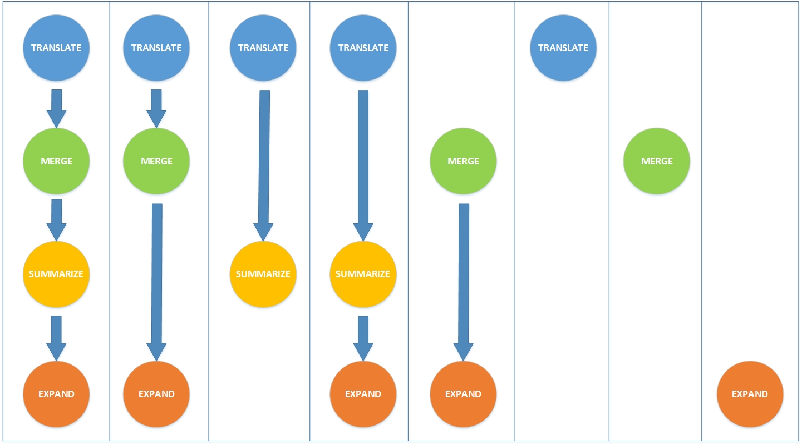

Command Details
===============

Jacquard is a suite of tools that can be either run in succession or
individually: translate, merge, summarize, and expand. Each of these tools is
discussed in detail below.

The typical workflow for Jacquard is to run VCF files through translate, merge,
summarize, and expand. However, any of the below workflows may be implemented
to obtain meaningful results.

   
   **Multiple Jacquard Workflows :** *There are 8 different possible workflows
   in Jacquard. The first workflow represented in the above diagram is the 
   signature workflow of Jacquard.*

The Jacquard-produced output VCFs are fully compliant VCF files that can be
easily loaded into an external program, such as an annotation tool.

Jacquard first writes output files to a temporary directory and only copies the
files upon successful completion of each subcommand.

Error, warning, and info messages are written to console and log file. Debug
messages are only written to the log file unless logger is initialized as
verbose (in which case debug is also echoed to console). 

Input File Conventions
----------------------
Jacquard assumes that the first element of the filename (up to the first dot)
is a patient identifier.

   patientA-113.mutect.vcf

   patientA-113.strelka.snv.vcf

   patientA-113.strelka.indel.vcf

This set of three files all have the same patient identifier (patientA-113) to
represent the same tumor-normal pair; these files will be combined into a
single pair of tumor-normals in the merged VCF. See
:ref:`merge <merge-command>` for more details.

To translate a specific VCF dialect, Jacquard determines the source variant
caller based on the VCF metaheaders. For this reason it is essential that you
preserve all metaheaders in the source VCF.

For a specific source VCF, Jacquard automatically determines the tumor and
normal samples based on the column header and the metaheaders.

.. _translate-command:

Translate
=========
The translate command creates new VCFs adding a controlled vocabulary of new
FORMAT tags. It will only work with VCF files from the supported variant
callers.

.. figure:: images/translate_pic.jpg

   **Addition of the Jacquard-Specific FORMAT Tags :** *The translated VCF files 
   contain the original FORMAT tags from the input files as well as the 
   Jacquard-specific FORMAT tags.*

Usage
-----

``jacquard translate <input_dir> <output_dir> [OPTIONS]``

*positional arguments:*

+--------+-------------------------+------------------------------------------------------------------+
| input  |                         | Directory containing VCF files (and VarScan high confidence      |
|        | files).                 |                                                                  |
|        |                         | Other file types ignored                                         |
+--------+-------------------------+------------------------------------------------------------------+
| output |                         | Directory containing VCF files. Will create if doesn't exist and |
|        | will overwrite files in |                                                                  |
|        |                         | output directory as necessary                                    |
+--------+-------------------------+------------------------------------------------------------------+

*optional arguments:*

+--------------------------------------+-------------------------------+-------------------------------------+
| --allow_inconsistent_sample_sets     |                               | Set this flag if not every patient  |
|                                      | is represented by the same    |                                     |
|                                      |                               | set of caller-VCFs.                 |
+--------------------------------------+-------------------------------+-------------------------------------+
| --varscan_hc_filter_file_regex REGEX |                               | Regex pattern that identifies       |
|                                      | optional VarScan              |                                     |
|                                      |                               | high-confidence filter files.       |
|                                      | The VCF, high-confidence file |                                     |
|                                      |                               | pairs should share the same prefix. |
|                                      | For example, given            |                                     |
|                                      |                               | patientA.snp.vcf,                   |
|                                      | patientA.indel.vcf,           |                                     |
|                                      |                               | patientA.snp.fpfilter.pass, and     |
|                                      | patientA.indel.fpfilter.pass, |                                     |
|                                      |                               | you could enable this option as     |
|                                      |                               | varscan_hc_filter_file_regex=       |
|                                      | '.fpfilter.pass$'             |                                     |
+--------------------------------------+-------------------------------+-------------------------------------+

Description
-----------
The translate command accepts a directory of VCF files and creates a new
directory of "translated" VCF files, which include several Jacquard-specific
FORMAT tags and their corresponding metaheaders.

You can gather all input VCFs into a single directory and run translate once, or
partition VCFs into separate directories (for example, by variant caller) and
run translate once for each input directory. When partitioning into separate
input directories, all file names must be unique.

Currently, Translate adds Jacquard-specific FORMAT tags for:
   * Allele Frequency
   * Depth
   * Genotype
   * Somatic Status
   * Passed: Indicates whether the variant record as a whole passed the VC
     filters; this tag is used later on when merging translated VCFs
   * Reported: This tag is used when merging translated VCFs.

See VCF metaheader excepts below for more details on how values are derived:

VarScan details
---------------

Jacquard-VarScan translated tags
^^^^^^^^^^^^^^^^^^^^^^^^^^^^^^^^
+--------------+--------------------------------------------------------+
| Tag name     | Description                                            |
+--------------+--------------------------------------------------------+
| JQ_VS_AF     | Jacquard allele frequency for VarScan: Decimal allele  |
|              | frequency rounded to 4 digits (based on FREQ)          |
+--------------+--------------------------------------------------------+
| JQ_VS_DP     | Jacquard depth for VarScan (based on DP)               |
+--------------+--------------------------------------------------------+
| JQ_VS_GT     | Jacquard genotype (based on GT)                        |
+--------------+--------------------------------------------------------+
| JQ_VS_HC_SOM | Jacquard somatic status for VarScan: 0=non-somatic,    |
|              | 1=somatic  (based on SOMATIC info tag and if sample is |
|              | TUMOR)                                                 |
+--------------+--------------------------------------------------------+

Jacquard can incorporate VarScan high-confidence files
^^^^^^^^^^^^^^^^^^^^^^^^^^^^^^^^^^^^^^^^^^^^^^^^^^^^^^

To translate VarScan calls, Jacquard requires the VarScan VCF files (snp
and/or indel). For each VarScan VCF, Jacquard can optionally accept VarScan
somatic high-confidence files; these are supplemental non-VCF files that list
variant records which passed a more stringent set of VarScan filters.

When high-confidence files are present, the translate command adds a FILTER
field value for low-confidence variant records (i.e. records which may have
initially passed filters, but are absent in the high-confidence files).

To use VarScan's somatic high-confidence files, they must be placed alongside
corresponding VarScan VCFs and must have the same file name prefix as their
corresponding VCF file. The high-confidence filename suffix can be
specified using the command line argument.

Example VarScan files:
   case_A.varscan.indel.vcf
   case_A.varscan.indel.Somatic.hc.filter.pass
   case_A.varscan.snp.vcf
   case_A.varscan.snp.Somatic.hc.filter.pass
   case_B.varscan.indel.vcf
   case_B.varscan.indel.Somatic.hc.filter.pass
   ...

.. _merge-command:

Merge
=====
The merge command integrates a directory of VCFs into a single VCF. It is 
caller-agnostic and can be used on any set of VCF files.

.. figure:: images/merge_join_step.jpg

   **The Merging Process :** *Sample-specific information is grouped together for 
   each patient.*

Usage
-----
``usage: jacquard merge <input_dir> <output_file> [OPTIONS]``

*positional arguments:*

+--------+-+----------------------------------------------------------+
| input  | | Directory containing VCF files. Other file types ignored |
+--------+-+----------------------------------------------------------+
| output | | A single VCF file                                        |
+--------+-+----------------------------------------------------------+

*optional arguments:*

+-----------------------+-----------------------------+----------------------------------------------------+
| --include_format_tags |                             | Comma-separated user-defined list of regular       |
|                       | expressions for format tags |                                                    |
|                       |                             | to be included in output.                          |
+-----------------------+-----------------------------+----------------------------------------------------+
| --include_cells       |                             | valid:  Only include valid variants                |
|                       |                             | all:  Include all variants                         |
|                       |                             | passed:  Only include variants which passed their  |
|                       | respective filter           |                                                    |
|                       |                             | somatic:  Only include somatic variants            |
+-----------------------+-----------------------------+----------------------------------------------------+
| --include_rows        |                             | at_least_one_somatic:  Include all variants at     |
|                       | loci where at least one     |                                                    |
|                       | variant                     |                                                    |
|                       |                             | was somatic                                        |
|                       |                             | all_somatic:  Include all variants at loci where   |
|                       | all variants were somatic   |                                                    |
|                       |                             | at_least_one_passed:  Include all variants at loci |
|                       | where at least one variant  |                                                    |
|                       |                             | passed                                             |
|                       |                             | all_passed:  Include all variants at loci where    |
|                       | all variants passed         |                                                    |
|                       |                             | all:  Include all variants at loci                 |
+-----------------------+-----------------------------+----------------------------------------------------+

Description
-----------
Conceptually, merging VCFs has four basic steps, each described in detail below:
# Merging matching loci from different VCFs into common rows
# Merging matching samples from different VCFs into common columns
# Optionally filtering tag values and rows
# Assembling the subset of FORMAT tags to be included in the final VCF

Merging matching loci
^^^^^^^^^^^^^^^^^^^^^
Jacquard first develops the superset of all loci (CHROM, POS, REF, and ALT) 
across the set of all input VCFs. For each locus, the input VCF FORMAT tags and
values are merged into a single row. Input variant record-level fields (such as
FILTER, INFO, etc.) are ignored.

MERGE_LOCI_IMAGE_HERE

Merging matching samples
^^^^^^^^^^^^^^^^^^^^^^^^
In the input files, a individual sample could be called by more than one variant
caller. When merging, Jacquard will combine results for the same sample into a
single column. Merged sample names are constructed by concatenating filename
prefix and VCF column header.

+--------------------+-----------------------------------+---------------------+
| Filename           | VCF Column header                 | Merged sample names |
+--------------------+-----------------------------------+---------------------+
| case_A.strelka.vcf | #CHROM ... FORMAT SAMPLE1 SAMPLE2 | case_A:SAMPLE1      |
|                    |                                   | case_A:SAMPLE2      |
+--------------------+-----------------------------------+---------------------+
| case_A.mutect.vcf  | #CHROM ... FORMAT SAMPLE1 SAMPLE2 | case_A:SAMPLE1      |
|                    |                                   | case_A:SAMPLE2      |
+--------------------+-----------------------------------+---------------------+
| case_B.strelka.vcf | #CHROM ... FORMAT SAMPLE3 SAMPLE4 | case_B:SAMPLE3      |
|                    |                                   | case_A:SAMPLE4      |
+--------------------+-----------------------------------+---------------------+
| case_B.mutect.vcf  | #CHROM ... FORMAT SAMPLE3 SAMPLE4 | case_B:SAMPLE3      |
|                    |                                   | case_A:SAMPLE4      |
+--------------------+-----------------------------------+---------------------+

Given the input VCFs above, the resulting merged VCF will have four sample
columns: case_A|SAMPLE1, case_A|SAMPLE2, case_B|SAMPLE1, case_B|SAMPLE2.

Filtering tag values and rows
^^^^^^^^^^^^^^^^^^^^^^^^^^^^^

By default, merge contains only Jacquard-translated format tags (JQ\_\.*) and
includes all variants with valid syntax at loci where at least one variant was
somatic. The resulting filtered files contain fewer rows, yet higher quality
data than the input files.

Though most variant callers have their own distinct set of format tags, some
tag names are common across multiple callers. If there are any format tag name
collisions, merge will add a prefix (e.g. JQ1_<original_tag>) in order to
disambiguate the format tags.

.. figure:: images/merge_filter_step.jpg

   **The Filtering Process :** *Rows and specific cells in the VCF files are 
   filtered based on the command-line options.*

After filtering, the merge command combines all of the input VCFs into a single
merged VCF that includes all necessary information for continuing your analysis.

The resulting VCF files contain the distinct set of all coordinates (CHROM, POS,
REF, and ALT) and samples from the input files, provided they pass the filters.
Each coordinate from the input VCF files is added to the output file, which
increases the file length. Additionally, sample columns are merged for each
patient, adding sample specific information and leading to increased column and
file width.

Importantly, rather than giving caller-wise sample columns in the output VCf
file, merge emits patient-wise sample columns. For each patient, the merge
command joins the set of corresponding sample columns into a single column. The
grouping of sample-specific information for each patient helps to easily
analyze the data.

.. _summarize-command:

Summarize
---------
The summarize command adds new INFO fields and FORMAT tags that combine variant
data from the merged VCF. It will only work with VCF files that have been
translated.

.. figure:: images/summarize.jpg

   **Summarizing Format Tags :** *The Jacquard-translated format tags from
   each caller are aggregated and processed together to create consensus format
   tags.* 

Usage
^^^^^
``usage: jacquard summarize <input_file> <output_file>``

*positional arguments:*

+--------+------------+---------------------------------------------------------------+
| input  |            | Jacquard-merged VCF file (or any VCF with Jacquard tags; e.g. |
|        | JQ_SOM_MT) |                                                               |
+--------+------------+---------------------------------------------------------------+
| output |            | A single VCF file                                             |
+--------+------------+---------------------------------------------------------------+

Description
^^^^^^^^^^^
The summarize command uses the Jacquard-specific tags to aggregate caller
information from the file, providing a summary-level view. The inclusion of
summary fields, such as averages, helps you to easily determine which are the
true variants.

The summarized format tags contain the prefix 'JQ_SUMMARY'.

.. _expand-command:

Expand
------
The expand command explodes a VCF file into a tab-separated file. It is not
caller-dependent and will work with any VCF file.

.. figure:: images/expand_columns.jpg

   **Expanding Columns :** *The INFO column and sample-specific FORMAT tags from
   the input VCF file are separated into distinct columns in the output file.*

Usage
^^^^^
``usage: jacquard expand <input_file> <output_file> [OPTIONS]``

*positional arguments:*

+--------+-+--------------------------------------+
| input  | | A VCF file. Other file types ignored |
+--------+-+--------------------------------------+
| output | | A TXT file                           |
+--------+-+--------------------------------------+

*optional arguments:*

+----------------------------------+-----------------------------+--------------------------------------+
| -s, --selected_columns_file FILE |                             | File containing an ordered list of   |
|                                  | column names to be included |                                      |
|                                  |                             | in the output file; column names can |
|                                  | include regular expressions |                                      |
+----------------------------------+-----------------------------+--------------------------------------+

Description
^^^^^^^^^^^
The expand command converts a VCF file into a tab-delimited file in a tabular
format. This format is more suitable than a VCF for analysis and visualization
in R, Pandas, Excel, or another third-party application.

.. figure:: images/expand_tabular.jpg

   **Tabular Format of Jacquard Output :** *Jacquard transforms the dense VCF
   format into a tabular format.*

The 'fixed' fields (i.e. CHROM, POS, ID, REF, ALT, QUAL, FILTER) are directly
copied from the input VCF file. Based on the metaheaders, each field in the
INFO column is expanded into a separate column named after its tag ID. Also,
based on the metaheaders, each FORMAT tag is expanded into a set of columns,
one for each sample, named as <FORMAT tag ID>|<sample column name>. By default,
all INFO fields and FORMAT tags are expanded; specific INFO fields and FORMAT
tags can be selected using a flag.

This command also emits a tab-delimited glossary file, created based on the
metaheaders in the input VCF file. FORMAT and INFO tag IDs are listed in the
glossary and are defined by their metaheader description.

.. figure:: images/expand_excel.jpg

   **Pattern Identification :** *The expanded output file can be visualized in a
   third-party tool to identify patterns in the dataset.* 

