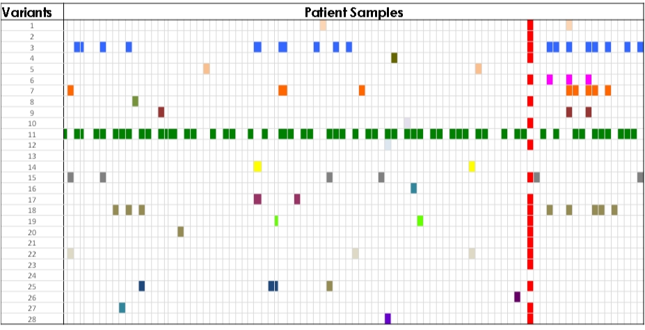
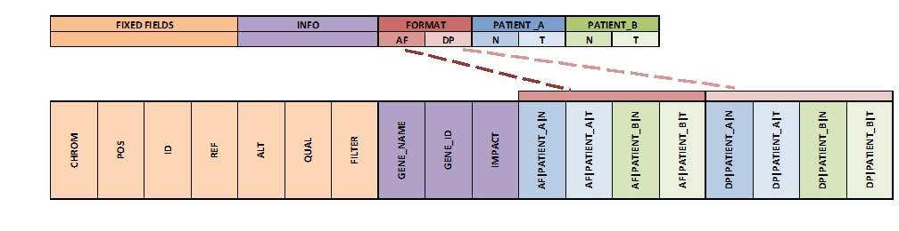

Expand
------
The expand command converts a VCF file into a tab-delimited file in a tabular
format. This format is more suitable than a VCF for analysis and visualization
in R, Pandas, Excel, or another third-party application.

.. figure:: images/expand_tabular.jpg

   **Tabular Format of Jacquard Output :** *Jacquard transforms the dense VCF
   format into a more comprehensible tabular format.*

   **Pattern Identification :** *The expanded output file can be visualized in a
   third-party tool to analyze different patterns in the dataset.* 

The 'fixed' fields (i.e. CHROM, POS, ID, REF, ALT, QUAL, FILTER) are directly
copied from the input VCF file. Based on the metaheaders, each field in the
INFO column is expanded into a separate column named after its tag ID. Also,
based on the metaheaders, each FORMAT tag is expanded into a set of columns,
one for each sample, named as <format tag ID>|<sample column name>.

This command also emits a tab-delimited glossary file, created based on the
metaheaders in the input VCF file. FORMAT and INFO tag IDs are listed in the
glossary and are defined by their metaheader description.

   **Expanding Columns :** *The INFO column and sample-specific format tags from
   the input VCF file are separated into distinct columns in the output file.*

Usage
^^^^^
``usage: jacquard expand <input_file> <output_file> [OPTIONS]``

*positional arguments:*
=====================   =======================================================
input                   VCF file. Other file types ignored
output                  TXT file
=====================   =======================================================

*optional arguments:*
================================       ========================================
-s, --selected_columns_file FILE       File containing an ordered list
                                       of column names to be included in the
                                       output file; column names can include
                                       regular expressions.
================================       ========================================
