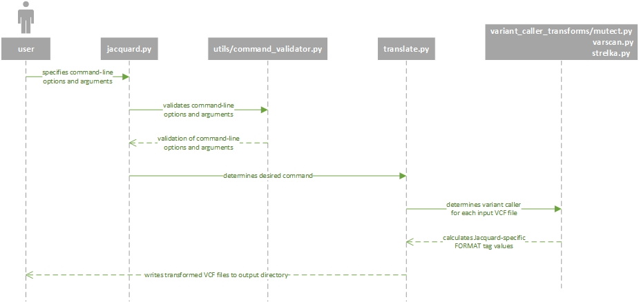

Implementation details
======================

Coding Conventions
------------------
 - Code should support Python 2.7 and 3.x without modification.
 - Use pylint to keep code PEP8 compliant.
 - Name variables, method, directory, module names as my_thing.
 - Name classes as MyClass.
 - Use absolute imports.
 - Encapsulate where possible; prefix private vars/methods/classes with "_".
 - Avoid globals.

Test Conventions
----------------
 - Use nosetests for automated testing.
 - Each module has a corresponding module_test.
 - TestCases should extend JacquardBaseTestCase
 - Top level methods are tested in ModuleTestCase.
 - Each class should have a test case (e.g. MyClassTestCase)
 - Every code path should have a unit test; prefer single assert per test.
   A test method name should reflect the method and code path as 
   {test_method_name}_{conditionUnderTest}; e.g.
   ``def test_my_method_returnsZeroIfMissingInput(self):``
 - Every command should have a functional test
 - Prefer unit tests to functional tests
 - Prefer tests on public methods, but note that it is sometimes easier to test
   a private method.
 - Attempt PEP8 compliance
 - Make tests independent.

General Architecture:
---------------------
Modules are typically:
 - commands (like *translate*): these modules are invoked from the command line; 
   they follow a simple command pattern.
 - variant caller transforms (like *mutect*): these modules contain classes that 
   add Jacquard annotations to a native VCF record.
 - utilities  (like *vcf* or *logger*): these modules provide a common method or
   class used by other modules.
Extending and adapting existing patterns will ensure commands/transforms stay
consistent. Here are some guidelines on how to extend functionality:

How to add a new format tag:
^^^^^^^^^^^^^^^^^^^^^^^^^^^^
For all variant callers that support the new tag, you will need to extend each
variant caller transform to:
 * define the new tag (set the metaheader and how the new value is derived)
 * add the new tag to the variant caller's reader
.. note:: If the new tag can be summarized, you will also need to add a
          corresponding tag to *summarize_rollup_transform*.

How to add a new variant caller:
^^^^^^^^^^^^^^^^^^^^^^^^^^^^^^^^
 * Add a new module in *variant_caller_transforms*.
 * In the new module, define the supported version.
 * Add supported tags (as described in section above).
 * Add a VcfReader class to interpret native VCFs to translated VCFs.
 * Add a new class named for the variant caller; define a claim method to
   recognize and claim VCF files.
 * Add the new variant caller class to *variant_caller_factory*.
.. note:: The variant caller should have no dependencies on other packages
          (except utils and vcf) and classes should only refer to variant
          callers through *variant_caller_factory* (except tests).

How to add a new command:
^^^^^^^^^^^^^^^^^^^^^^^^^
 * Add a new module in *jacquard*, named for the command.
 * In the new module, add the methods:

   * add_subparser(subparser) with appropriate help and defaults.
   * get_required_input_output_types().
   * validate_args(args).
   * report_prediction
   * execute(args, execution_context).
.. note:: Commands are independent and should not refer to other commands.

|

   **UML Sequence Diagram :** *An example UML sequence diagram for Translate.
   Other commands follow a similar sequence.*

