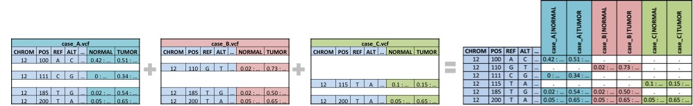
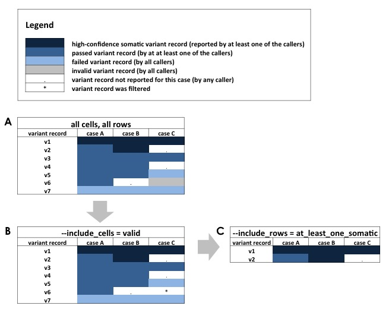

.. _merge-command:

Merge
=====
The *merge* command integrates a directory of VCFs into a single VCF. It is
caller-agnostic and can be used on any set of VCF files.

Usage
-----
::

   $ jacquard merge <input_dir> <output_file>
                    [--include_format_tags=JQ_.*]
                    [--include_cells=valid]
                    [--include_rows=at_least_one_somatic]

*positional arguments:*

+-------------+----------------------------------------------------------------+
| input_dir   | | Directory containing input VCF files to be merged            |
+-------------+----------------------------------------------------------------+
| output_file | | An integrated VCF file                                       |
+-------------+----------------------------------------------------------------+

*optional arguments:*

+------------------------+-----------------------------------------------------+
| --include_format_tags= | | Comma-separated user-defined list of regular      |
|                        | | expressions for format tags to be included in     |
|                        | | output; (defaults to **'JQ_.*'**)                 |
+------------------------+-----------------------------------------------------+
| --include_cells=       | | all:  Include all variants                        |
|                        | | **valid**:  Only include valid variants           |
|                        | | passed:  Only include variants which passed their |
|                        | |          respective filter                        |
|                        | | somatic:  Only include somatic variants           |
+------------------------+-----------------------------------------------------+
| --include_rows=        | | all:  Include all variants at loci                |
|                        | | at_least_one_passed:  Include all variants at loci|
|                        | |    where at least one variant passed              |
|                        | | all_passed:  Include all variants at loci where   |
|                        | |    all variants passed                            |
|                        | | **at_least_one_somatic**:  Include all variants at|
|                        | |    loci where at least one variant was high-      |
|                        | |    confidence somatic                             |
|                        | | all_somatic:  Include all variants at loci where  |
|                        | |    all variants were high-confidence somatic      |
+------------------------+-----------------------------------------------------+
| --include_all          | | Equivalent to:                                    |
|                        | |    --include_format_tags='.*'                     |
|                        | |    --include_cells=all                            |
|                        | |    --include_rows=all                             |
|                        | | Useful when merging untranslated VCFs.            |
+------------------------+-----------------------------------------------------+

Description
-----------

Conceptually, *merge* has four basic steps, each described in detail below.

 #. Integrate matching loci from different VCFs into common rows
 #. Combine matching samples from different VCFs into common columns
 #. Filter tag values and rows
 #. Assemble the subset of FORMAT tags to be included in the final VCF

Integrate matching loci
^^^^^^^^^^^^^^^^^^^^^^^
*Merge* first develops the superset of all loci (CHROM, POS, REF, and ALT) 
across the set of all input VCFs. For each locus, the input VCF FORMAT tags and
values are merged into a single row. Input variant record-level fields (such as
FILTER, INFO, etc.) are ignored.

   **Matching loci :** *Variant records from separate files that share the same
   CHROM, POS, REF, ALT are merged into a single variant record.*

Combine matching samples
^^^^^^^^^^^^^^^^^^^^^^^^
In the input directory, an individual sample could be called by more than one
variant caller. When merging, Jacquard combines results from the same sample
into a single column. Merged sample names are constructed by concatenating the
filename prefix and the VCF column header.

+--------------------+-----------------------------------+---------------------+
| Filename           | VCF Column header                 | Merged sample names |
+--------------------+-----------------------------------+---------------------+
| case_A.strelka.vcf | #CHROM ... FORMAT SAMPLE1 SAMPLE2 | | case_A|SAMPLE1    |
|                    |                                   | | case_A|SAMPLE2    |
+--------------------+-----------------------------------+---------------------+
| case_A.mutect.vcf  | #CHROM ... FORMAT SAMPLE1 SAMPLE2 | | case_A|SAMPLE1    |
|                    |                                   | | case_A|SAMPLE2    |
+--------------------+-----------------------------------+---------------------+
| case_B.strelka.vcf | #CHROM ... FORMAT SAMPLE3 SAMPLE4 | | case_B|SAMPLE3    |
|                    |                                   | | case_B|SAMPLE4    |
+--------------------+-----------------------------------+---------------------+
| case_B.mutect.vcf  | #CHROM ... FORMAT SAMPLE3 SAMPLE4 | | case_B|SAMPLE3    |
|                    |                                   | | case_B|SAMPLE4    |
+--------------------+-----------------------------------+---------------------+

Given the input VCFs above, the resulting merged VCF will have four sample
columns:

 * case_A | SAMPLE1
 * case_A | SAMPLE2
 * case_B | SAMPLE3
 * case_B | SAMPLE4

.. figure:: images/merge_join_step.jpg

   **Combine matching samples :** *Case-specific information reported in 
   different files is combined into a single case|sample column.*

Filter cell values and rows
^^^^^^^^^^^^^^^^^^^^^^^^^^^

Variant records are filtered to highlight the high-confidence somatic variants.

For VCFs from supported callers, *merge* filters the result to include only
valid variants records where at least one variant at that loci was somatic. The
filter stringency can be set with flags described above. Since these filters
operate on Jacquard tags, *merge* cannot filter VCFs from unsupported callers;
use --include_all for untranslated VCF files.

   **Filter cell values and rows :** *(A) Beginning with the matrix of all
   variant records, (B) the include_cells flag transforms excluded cells 
   (sample-records) from their original value to "." (not-observed). (C) 
   Finally, the include_row flag excludes entire loci.*

Assemble the subset of FORMAT tags
^^^^^^^^^^^^^^^^^^^^^^^^^^^^^^^^^^

*Merge* builds a new set of INFO tags and returns a subset of incoming FORMAT
tags. By default, Jacquard only carries forward tags that begin with 'JQ', i.e.
Jacquard-translated tags. When working with VCFs from unsupported callers, use
--include_format_tags or --include_all to merge unstranslated VCFs.

Note that while most variant callers have their own distinct set of FORMAT tags,
some tag names are common across multiple callers. If there are any FORMAT tag
name collisions, *merge* will add a prefix (e.g. JQ1_<original_tag>) in order
to disambiguate the FORMAT tags.

