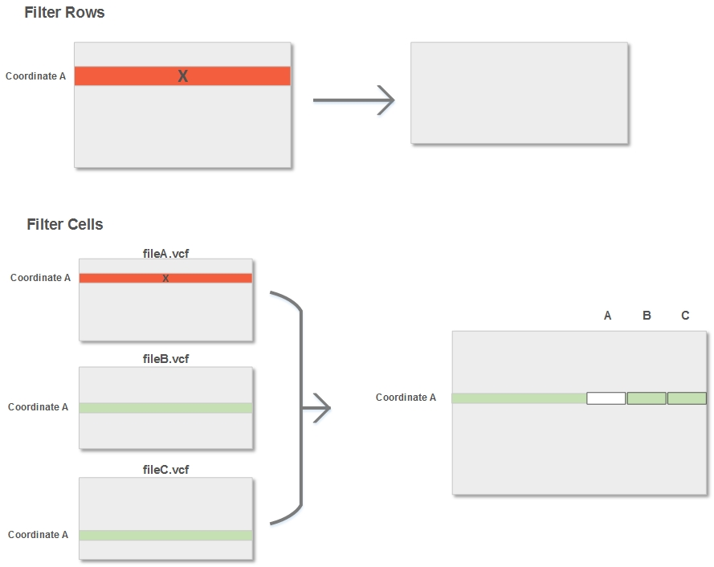

Merge
-----
The merge command takes an input directory of VCFs and filters both the
variants and format tags based on your specifications.

By default, merge contains only Jacquard-translated format tags (JQ\_\.*) and
includes all variants with valid syntax at loci where at least one variant was
somatic. The resulting filtered files contain fewer rows, yet higher quality
data than the input files.

Though most variant callers have their own distinct set of format tags, some
tag names are common across multiple callers. If there are any format tag name
collisions, merge will add a prefix (e.g. JQ1_<original_tag>) in order to
disambiguate the format tags.

   **The Filtering Process :** *Rows and specific cells in the VCF files are 
   filtered based on the command-line options.*

After filtering, the merge command combines all of the input VCFs into a single
merged VCF that includes all necessary information for continuing your analysis.

The resulting VCF files contain the distinct set of all coordinates (CHROM, POS,
REF, and ALT) and samples from the input files, provided they pass the filters.
Each coordinate from the input VCF files is added to the output file, which
increases the file length. Additionally, sample columns are merged for each
patient, adding sample specific information and leading to increased column and
file width.

Importantly, rather than giving caller-wise sample columns in the output VCf
file, merge emits patient-wise sample columns. For each patient, the merge
command joins the set of corresponding sample columns into a single column. The
grouping of sample-specific information for each patient helps to easily
analyze the data.

.. figure:: images/merge_join_step.jpg

   **The Merging Process :** *Sample-specific information is grouped together for 
   each patient.*

|

Usage
^^^^^
``usage: jacquard merge <input_dir> <output_file> [OPTIONS]``

*positional arguments:*

======================        =================================================
input                         Directory containing VCF files. Other file types
                              ignored
output                        VCF file
======================        =================================================

*optional arguments:*

========================    ===================================================
--include_format_tags       Comma-separated user-defined list of regular
                            expressions for format tags to be included in
                            output
--include_cells             valid:  Only include valid variants
                            all:  Include all variants
                            passed:  Only include variants which passed their
                                     respective filter
                            somatic:  Only include somatic variants
--include_rows              at_least_one_somatic:  Include all variants at loci
                                                   where at least one variant
                                                   was somatic
                            all_somatic:  Include all variants at loci where all
                                          variants were somatic
                            at_least_one_passed:  Include all variants at loci
                                                  where at least one variant
                                                  passed
                            all_passed:  Include all variants at loci where all
                                         variants passed
                            all:  Include all variants at loci
========================    ===================================================
