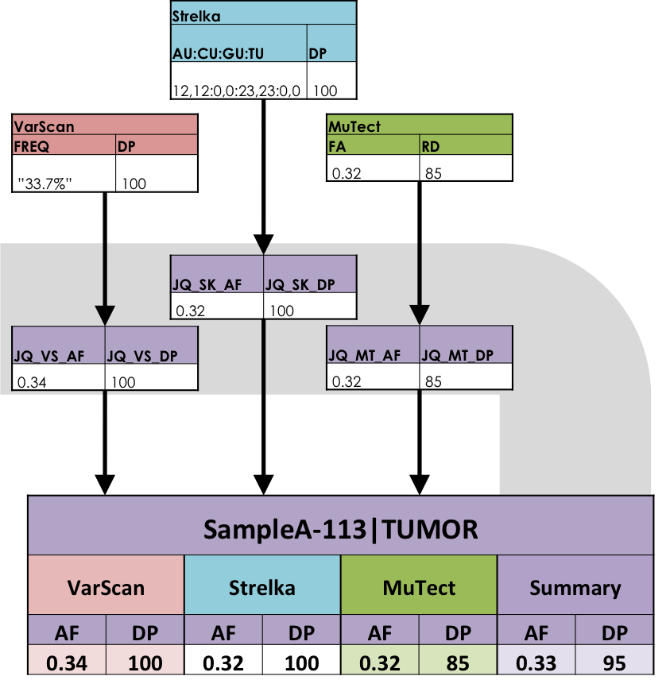

.. _overview-page:

Overview
========

Jacquard is an open source suite of Python command line tools that provides a
practical approach to integrating multiple patient samples and multiple
variant callers. Jacquard is designed to be used by bioinformatic analysts; the
output is intended to be useful to analysts and biological researchers. Both
Jacquard and its documentation assume that users the basics of variant callers
and VCF files. For more information about VCF files, see the
`1000 Genomes documentation <http://www.1000genomes.org/node/101>`_.

Why would I use Jacquard?
-------------------------

Jacquard makes it easier to analyze multi-patient tumor-normal datasets
especially when using multiple vairant callers.

Most variant callers have embraced the Variant Call Format (VCF) standard
[r2]_, a file format which clearly and succinctly describes variants from one or
more samples. However, while many callers follow the standard, they often
adopt different ways to partition results (e.g. somatic file vs. germline file,
or SNP vs. indel); likewise, each caller creates its own dialect of VCF fields
and tags [r3]_ [r5]_ [r7]_.

Moreover, each variant caller follows its own algorithms, and produces different
results for the same inputs. Because of this, it is valuable to run data through
multiple variant callers and compare the outputs [r3]_ [r5]_ [r7]_. However,
since each caller has its own dialect, direct comparisons are difficult.

Jacquard transforms the dialects of different variant callers into a
controlled vocabulary of tags with a consistent representation of values.
Furthermore, it intelligently merges VCFs from different patients and callers
to create a single, unified VCF across your dataset. The consistent tag names
and represntations expedite downstream analysis; the intgrated VCF highlights
both the prevelance of specific variants and the overall mutation loads across
samples.

   **Jacquard normalized VCF dialects:** *Each variant caller records depth or
   alt frequency with a different tag name and representation. Jacquard
   translates format tags from different callers into a uniform set of tags.*

Jacquard can merge or exapnd VCFs from any variant caller. Jacquard can 
translate depth, alt frequency, somatic status, and genotype tags from several 
somatic variant callers:

* MuTect [r1]_
* VarScan [r4]_
* Strelka [r6]_

Contact Us
----------
Email bfx-jacquard@umich.edu for support and questions.

UM BRCF Bioinformatics Core
