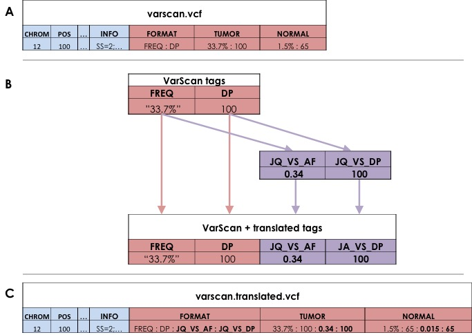

.. _translate-command:

Translate
=========
The translate command creates new VCFs, adding a controlled vocabulary of new
FORMAT tags. It will only work with VCF files from the supported variant
callers.

   **Translate adds new FORMAT Tags :** *(A) Jacquard reads input VCF
   files (B) deriving new tags based on information in each variant record and 
   (C) writes new VCFs appending the new tags to the original record.*

Usage
-----
::

   jacquard translate <input_dir> <output_dir> [OPTIONS]

*positional arguments:*

+------------+-----------------------------------------------------------------+
| input_dir  | | Directory containing VCF files (and VarScan high confidence   |
|            |   files)                                                        |
+------------+-----------------------------------------------------------------+
| output_dir | | Directory containing VCF files. Will create if doesn't exist  |
|            | | and will overwrite files in output directory if --force       |
+------------+-----------------------------------------------------------------+

*optional arguments:*

+----------------------------------+-------------------------------------------+
| --allow_inconsistent_sample_sets | | Set this flag if not every patient is   |
|                                  | | represented by the same set of          |
|                                  | | caller-VCFs. (For example if you ran    |
|                                  | | VarScan on only a subset of cases.)     |
+----------------------------------+-------------------------------------------+
| --varscan_hc_filter_file_regex=  | | Regex pattern that identifies optional  |
|                                  | | optional VarScan high-confidence filter |
|                                  | | files.                                  |
|                                  | | The VCF, high-confidence file pairs     |
|                                  | | should share the same prefix. For       |
|                                  | | example, given files:                   |
|                                  | |    patientA.snp.vcf                     |
|                                  | |    patientA.indel.vcf                   |
|                                  | |    patientA.snp.fpfilter.pass           |
|                                  | |    patientA.indel.fpfilter.pass         |
|                                  | | you could enable this option as         |
|                                  | | varscan_hc_filter_file_regex=           |
|                                  | |    '.fpfilter.pass$'                    |
+----------------------------------+-------------------------------------------+

Description
-----------
The translate command accepts a directory of VCF files and creates a new
directory of "translated" VCF files, which include several Jacquard-specific
FORMAT tags and their corresponding metaheaders.

You can either gather all input VCFs into a single directory and run translate
once or partition VCFs into separate directories (for example, by variant
caller) and run translate once for each input directory. When partitioning into
separate input directories, all file names must be unique.

Currently, Translate adds Jacquard-specific FORMAT tags for:
   * Allele Frequency
   * Depth
   * Genotype
   * Somatic Status
   * Passed: Indicates whether the variant record as a whole passed the VC
     filters; this tag is used later on when merging translated VCFs
   * Reported: This tag is used when merging translated VCFs.

See VCF metaheader excepts below for more details on how values are derived:

Strelka Translated Tags
-----------------------

+--------------+---------------------------------------------------------------+
| Tag name     | | Description                                                 |
+--------------+---------------------------------------------------------------+
| JQ_SK_AF     | | Jacquard allele frequency for Strelka: Decimal allele       |
|              | | frequency rounded to 4 digits (based on                     |
|              | | alt_depth/total_depth. Uses [TIR tier 2]/DP2 if available,  |
|              | | otherwise uses (ACGT tier2 depth) / DP2)                    |
+--------------+---------------------------------------------------------------+
| JQ_SK_DP     | | (uses DP2 if available, otherwise uses ACGT tier2 depth)    |
+--------------+---------------------------------------------------------------+
| JQ_VS_GT     | | Jacquard genotype (based on SGT).                           |
|              | | Example for snv: ALT=C, INFO:SGT=AA->AC is translated as    |
|              | | normal=0/0, tumor=0/1.                                      |
|              | | Example for indel: INFO:SGT=ref->het is translated as       |
|              | | normal=0/0, tumor=0/1.                                      |
+--------------+---------------------------------------------------------------+
| JQ_VS_HC_SOM | | Jacquard somatic status for Strelka:                        |
|              | | 0=non-somatic,1=somatic (based on PASS in FILTER column)    |
+--------------+---------------------------------------------------------------+

MuTect Translated Tags
----------------------

+--------------+---------------------------------------------------------------+
| Tag name     | | Description                                                 |
+--------------+---------------------------------------------------------------+
| JQ_SK_AF     | | Jacquard allele frequency for MuTect: Decimal allele        |
|              | | frequency rounded to 4 digits (based on FA).                |
+--------------+---------------------------------------------------------------+
| JQ_SK_DP     | | Jacquard depth for MuTect (based on DP)                     |
+--------------+---------------------------------------------------------------+
| JQ_MT_GT     | | Jacquard genotype (based on GT)                             |
+--------------+---------------------------------------------------------------+
| JQ_MT_HC_SOM | | MuTect: 0=non-somatic,1=somatic (based on SS FORMAT tag)    |
+--------------+---------------------------------------------------------------+

VarScan Translated Tags
-----------------------

+--------------+---------------------------------------------------------------+
| Tag name     | | Description                                                 |
+--------------+---------------------------------------------------------------+
| JQ_VS_AF     | | Jacquard allele frequency for VarScan: Decimal allele       |
|              |   frequency rounded to                                        |
|              | | 4 digits (based on FREQ)                                    |
+--------------+---------------------------------------------------------------+
| JQ_VS_DP     | | Jacquard depth for VarScan (based on DP)                    |
+--------------+---------------------------------------------------------------+
| JQ_VS_GT     | | Jacquard genotype (based on GT)                             |
+--------------+---------------------------------------------------------------+
| JQ_VS_HC_SOM | | Jacquard somatic status for VarScan: 0=non-somatic,         |
|              | | 1=somatic (based on SOMATIC info tag where sample column is |
|              | | TUMOR and variant record passed VarScan filter).            |
+--------------+---------------------------------------------------------------+

Jacquard can incorporate VarScan high-confidence files
^^^^^^^^^^^^^^^^^^^^^^^^^^^^^^^^^^^^^^^^^^^^^^^^^^^^^^

To translate VarScan calls, Jacquard requires the VarScan VCF files (snp
and/or indel). For each VarScan VCF, Jacquard can optionally accept VarScan
somatic high-confidence files; these are supplemental non-VCF files that list
variant records which passed a more stringent set of VarScan filters.

When high-confidence files are present, the translate command adds a FILTER
field value for low-confidence variant records (i.e. records which may have
initially passed filters, but are absent in the high-confidence files).

To use VarScan's somatic high-confidence files, they must be placed alongside
corresponding VarScan VCFs and must have the same file name prefix as their
corresponding VCF file. The high-confidence filename suffix can be
specified using the command line argument.

Example VarScan files:
 | case_A.varscan.indel.vcf
 | case_A.varscan.indel.Somatic.hc.filter.pass
 | case_A.varscan.snp.vcf
 | case_A.varscan.snp.Somatic.hc.filter.pass
 | case_B.varscan.indel.vcf
 | case_B.varscan.indel.Somatic.hc.filter.pass
 | ...

